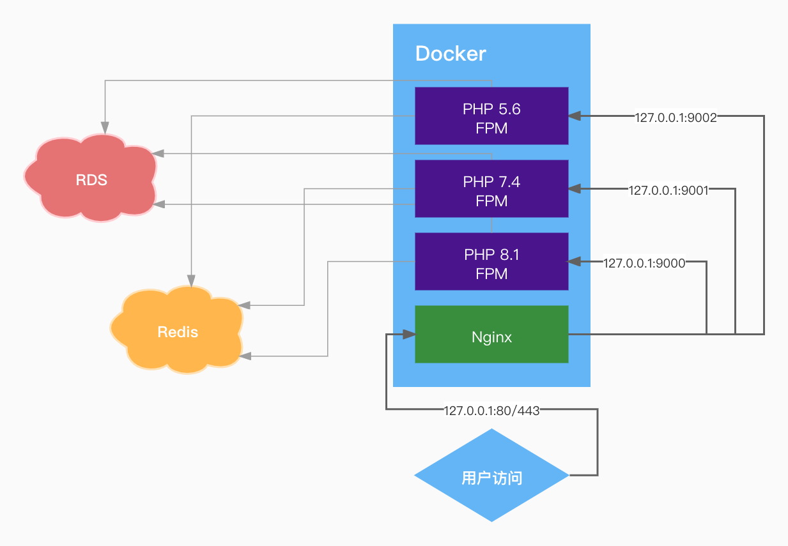

# Nginx & PHP Run in Docker
multiple php version and nginx run in docker



## 🍵 &nbsp;Qucik Start
Make sure you have git, docker and docker-compose installed locally

#### My local Docker version
- Docker v20.10.12
- Docker Compose v2.2.3

#### Run
- Run `git clone https://github.com/Bantes/docker-np.git` and `docker-compose up -d` at project root directory.
- Open the browser and enter `http://localhost` to see default phpinfo (default website use php 5.6)

#### Create Website(HTTP)
- Run `cd vhosts` and `touch example.conf`
- Run `vim example.conf`

```
server {
  listen 80;
  server_name example.com;
  access_log off;
  error_log /var/log/nginx/error_example.log;
  root /var/www/html/example.com;
  index index.html index.htm index.php;

  location ~ [^/]\.php(/|$) {
    # php56:9000 php74:9000 php81:9000
    fastcgi_pass php56:9000;
    fastcgi_index index.php;
    include fastcgi.conf;
  }

  location ~ .*\.(gif|jpg|jpeg|png|bmp|swf|flv|mp4|ico)$ {
    expires 30d;
    access_log off;
  }

  location ~ .*\.(js|css)?$ {
    expires 7d;
    access_log off;
  }
  
  location ~ ^/(\.user.ini|\.ht|\.git|\.svn|\.project|LICENSE|README.md) {
    deny all;
  }
}
```
- Upload your website to `domains/example.com`
- Run `docker-compose restart nginx`

#### Create Website(HTTPS)
- Copy your ssl keys to `sslkeys/example.com` directory
- Run `cd vhosts` and `touch example.conf`
- Run `vim example.conf`
```
server {
  listen 80;
  listen 443 ssl http2;
  ssl_certificate   /etc/nginx/ssl/example.com/example.pem;
  ssl_certificate_key  /etc/nginx/ssl/example.com/example.key;
  ssl_protocols TLSv1 TLSv1.1 TLSv1.2;
  ssl_ciphers ECDHE-RSA-AES128-GCM-SHA256:ECDHE:ECDH:AES:HIGH:!NULL:!aNULL:!MD5:!ADH:!RC4;
  ssl_prefer_server_ciphers on;
  ssl_session_timeout 10m;
  ssl_session_cache builtin:1000 shared:SSL:10m;
  ssl_buffer_size 1400;
  add_header Strict-Transport-Security max-age=15768000;
  ssl_stapling on;
  ssl_stapling_verify on;
  server_name example.com www.example.com;
  access_log off;
  error_log /var/log/nginx/error_example.log;
  index index.html index.htm index.php;
  root /var/www/html/example.com;

  if ($ssl_protocol = "") { return 301 https://$server_name$request_uri; }

  location / {
    try_files $uri $uri/ /index.php?$query_string;
  }

  location ~ [^/]\.php(/|$) {
    # php56:9000 php74:9000 php81:9000
    fastcgi_pass php74:9000;
    fastcgi_index index.php;
    include fastcgi.conf;
  }
  location ~ .*\.(gif|jpg|jpeg|png|bmp|swf|flv|mp4|ico)$ {
    expires 30d;
    access_log off;
  }
  location ~ .*\.(js|css)?$ {
    expires 7d;
    access_log off;
  }
  location ~ /\.ht {
    deny all;
  }
}
```
- Upload your website to `domains/example.com`
- Run `docker-compose restart nginx`

## 🖥 &nbsp;docker-compose.yml

```
version: '3.7'
services:
  nginx:
    image: nginx:alpine           # 镜像名称
    container_name: nginx         # 容器名字
    restart: always               # 开机自动重启
    privileged: true
    ports:                        # 端口号绑定（宿主机:容器内）
      - '80:80'
      - '443:443'
    environment:
      - TZ=Asia/Shanghai          # 时区
    volumes:                      # 目录映射（宿主机:容器内）
      - ./configs/nginx/nginx.conf:/etc/nginx/nginx.conf:ro
      - ./vhosts:/etc/nginx/conf.d:ro
      - ./domains:/var/www/html
      - ./wwwlogs/nginx:/var/log/nginx
      - ./sslkeys:/etc/nginx/ssl
    networks:
      - nginx_bridge
  
  php81:
    build:
      context: ./dockerfiles/php81
      dockerfile: Dockerfile
    container_name: php81
    restart: always
    privileged: true
    volumes:
      - ./domains:/var/www/html
      - ./configs/php81:/usr/local/etc/php
      - ./wwwlogs/supervisord.log:/var/log/supervisor/supervisord.log
    ports:
      - "9000:9000"
    networks:
      - nginx_bridge

  php74:
    build:
      context: ./dockerfiles/php74
      dockerfile: Dockerfile
    container_name: php74
    restart: always
    privileged: true
    volumes:
      - ./vhosts:/var/www/vhosts
      - ./domains:/var/www/html
      - ./configs/php74:/usr/local/etc/php
    ports:
      - "9001:9000"
    networks:
      - nginx_bridge

  php56:
    build:
      context: ./dockerfiles/php56
      dockerfile: Dockerfile
    container_name: php56
    restart: always
    privileged: true
    volumes:
      - ./domains:/var/www/html
      - ./configs/php56:/usr/local/etc/php
    ports:
      - "9002:9000"
    networks:
      - nginx_bridge

networks:
  nginx_bridge:
    driver: bridge
```

## 💼 &nbsp;Project structure
```
.
├── configs
│   ├── nginx
│   │   └── nginx.conf
│   ├── php56
│   │   ├── conf.d
│   │   └── php.ini
│   ├── php74
│   │   ├── conf.d
│   │   └── php.ini
│   └── php81
│       ├── conf.d
│       └── php.ini
├── docker-compose.yml
├── dockerfiles
│   ├── php56
│   │   └── Dockerfile
│   ├── php74
│   │   └── Dockerfile
│   └── php81
│       ├── Dockerfile
│       └── supervisord.conf
├── domains
│   └── default
│       └── index.php
├── sslkeys
├── vhosts
│   └── default.conf
├── wechatpay
└── wwwlogs
    └── nginx
```